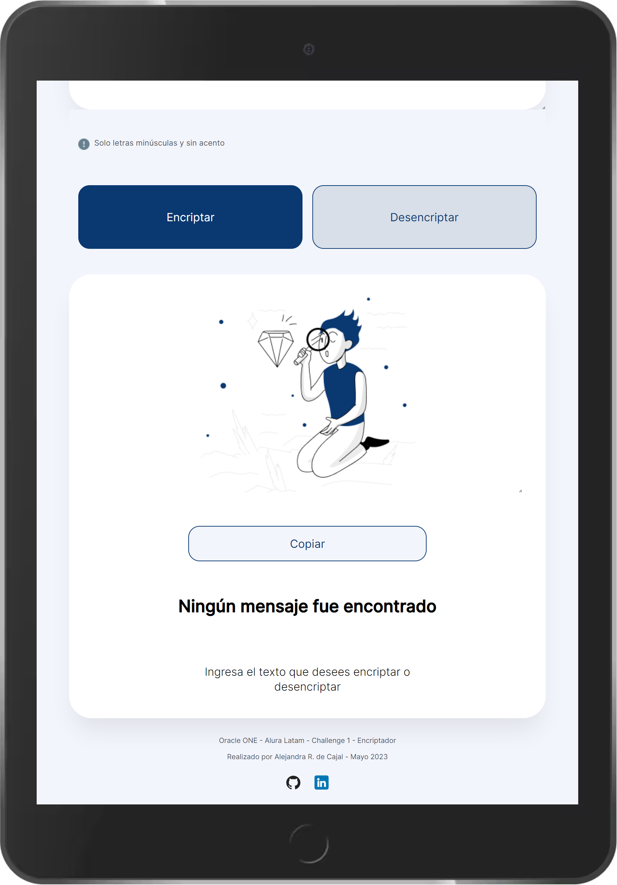

# Edición #5: Challenge ONE Principiante en programación.

 

**Enlace al encriptador:**
`<link>` : <https://oracle-alura.github.io/Challenge1Encriptador/>

## Descripción

**Construcción de un encriptador de texto con Javascript.**

- 01:
Implementación de los proyectos con HTML, CSS y JavaScript

- 02:
Profundizando en el uso de JavaScript para agregar funcionalidades al sistema

## Requisitos del proyecto

- Debe funcionar solo con letras minúsculas
- No deben ser utilizados letras con acentos ni caracteres especiales
- Debe ser posible convertir una palabra para la versión encriptada también devolver una palabra encriptada para su versión original.
- La página debe tener campos para inserción del texto que será encriptado o desencriptado, y el usuario debe poder escoger entre as dos opciones.
- El resultado debe ser mostrado en la pantalla.
- Tiempo máximo: 4 semanas.

**EXTRAS:**

- Un botón que copie el texto encriptado/desencriptado para la sección de transferencia, o sea que tenga la misma funcionalidad del ctrl+C o de la opción "copiar" del menú de las aplicaciones.

- Como extra de extra se adicionó un botón "pegar" que aparece cuando se copia el texto encriptado. Posee la misma funcionalidad de "boton derecho + pegar", sobre el cuadro de texto principal, para poder realizar el desencriptado.

## Tecnologias

- HTML
- CSS
- JS

## Capturas

 

## Lenguajes

## Funciones

- Se escribe o se pega el texto a encriptar en el cuadro de texto principal (en minúsculas y sin acentos).
- Presionar el botón "Encriptar".
- El texto encriptado aparecerá en el cuadro de texto contiguo.
- Para desencriptar el texto, presionar el botón "Copiar", luego "Pegar" en el primer cuadro de texto y finalmente "Desencriptar".
- El texto desencriptado aparecerá en el cuadro de texto correspondiente.
